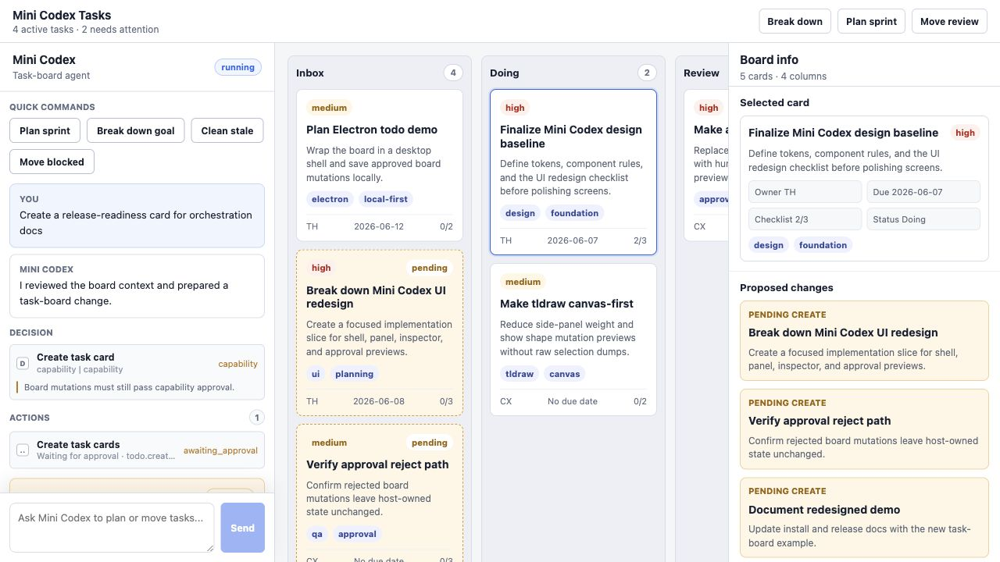
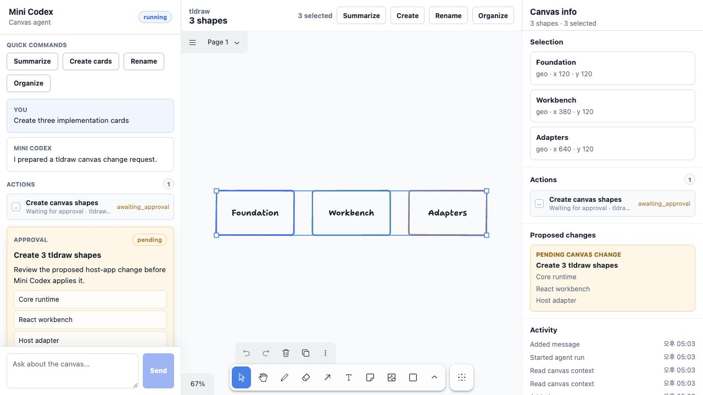
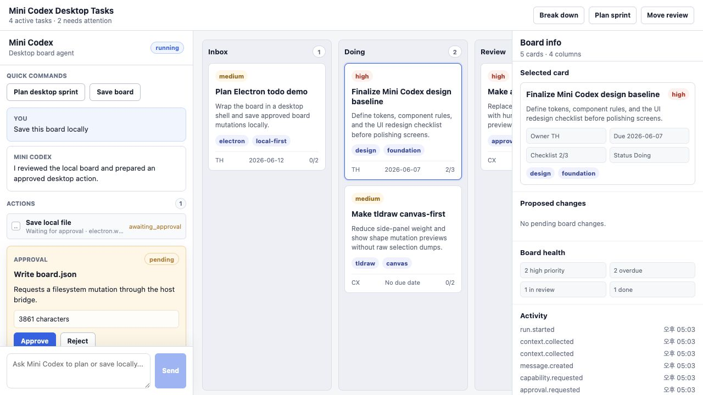

# Mini Codex

Mini Codex is an embeddable Codex-powered agent workbench for applications that
already have a real workspace.

```bash
npm install mini-codex
```

Use Mini Codex when you want an agent to understand your app state, propose
changes, ask for approval, and apply host-owned mutations through explicit
capabilities. It is not a generic chatbot widget. It is a small runtime and UI
surface for adding an agent workbench to tools such as canvases, editors,
dashboards, design apps, document surfaces, internal tools, and Electron apps.

## Screenshots

Task-board host app with approval-gated card creation:



tldraw host app with canvas-aware actions and proposed shape changes:



Electron-style local workflow with approval-gated filesystem writes:



## Why Mini Codex?

Most product teams do not need a floating chatbot. They need an agent that can
work inside the product surface the user is already using.

Mini Codex gives you the pieces for that pattern:

- collect compact context from the host app
- let an agent reason over that context
- request host-defined actions
- decide the safest route before execution
- preview the proposed change
- wait for approval when a mutation is risky
- apply the change through your app code
- show the run as readable activity

The host application stays in charge. Mini Codex coordinates the agent runtime,
events, UI, approvals, and adapter boundaries.

## When To Use It

Mini Codex is a good fit when your app has:

- a canvas, board, editor, file, model, document, or other workspace
- app-specific actions that should be callable by an agent
- changes that should be previewed before they are applied
- local or desktop workflows where filesystem access must stay behind a safe
  bridge
- a need for a reusable agent panel instead of a one-off assistant sidebar

It is not the right abstraction if all you need is a simple support chat bubble,
a pure text completion API wrapper, or an agent that directly owns your app
state.

## Mental Model

```text
Host app state
  -> context providers
  -> Mini Codex runtime
  -> orchestration decision
  -> agent adapter
  -> capability request
  -> approval preview
  -> host-owned mutation
```

The most important rule is simple:

```text
Mini Codex does not mutate your application directly.
Your app registers capabilities, and your app applies the final mutation.
```

## Install

```bash
npm install mini-codex react react-dom
```

Import the default styles once:

```tsx
import "mini-codex/styles.css";
```

## Minimal React Usage

```tsx
import { createMiniCodex } from "mini-codex";
import {
  MiniCodexPanel,
  MiniCodexProvider,
  MiniCodexWorkbench
} from "mini-codex/react";
import "mini-codex/styles.css";

const runtime = createMiniCodex();

export function App() {
  return (
    <MiniCodexProvider runtime={runtime}>
      <MiniCodexWorkbench
        left={<MiniCodexPanel />}
        center={<main>Your host workspace</main>}
      />
    </MiniCodexProvider>
  );
}
```

## Register Host Context

Context providers expose compact, JSON-serializable state to the agent run.
Keep this data small and intentional.

```ts
runtime.registerContextProvider({
  name: "board.current",
  description: "Current board selection and column summary",
  getContext: () => ({
    selectedCardId: "card-1",
    columns: [
      { id: "todo", count: 4 },
      { id: "doing", count: 2 },
      { id: "done", count: 7 }
    ]
  })
});
```

## Register Host Capabilities

Capabilities are the actions the agent may request. Mutating capabilities should
usually require approval and provide a preview.

```ts
runtime.registerCapability({
  name: "board.createCard",
  description: "Create a card in the host board",
  effect: "write",
  approval: "always",
  preview: (input) => ({
    title: "Create card",
    description: "Adds a new card to the host-owned board.",
    changes: [`Create ${JSON.stringify(input)}`]
  }),
  run: async (input) => {
    // Apply the mutation through your app code.
    return { created: true, input };
  }
});
```

## Add Orchestration

Use `mini-codex/orchestration` when the host app wants a small decision layer
before the agent starts calling capabilities.

```ts
import { createMiniCodex } from "mini-codex";
import { createDefaultOrchestrator } from "mini-codex/orchestration";

const runtime = createMiniCodex({
  orchestrator: createDefaultOrchestrator({
    actions: [
      {
        name: "answer-board-question",
        label: "Answer board question",
        description: "Answer without mutating host state.",
        executionBoundary: "answer"
      },
      {
        name: "create-card",
        label: "Create card",
        description: "Prepare a host-owned card mutation.",
        executionBoundary: "capability",
        requiresApproval: true
      }
    ],
    selectAction: (input) => (
      input.userMessage.includes("?") ? "answer-board-question" : "create-card"
    )
  })
});
```

Orchestration records a display-safe graph with the selected action, gates,
execution policy, observations, and final claim level. It does not bypass
capabilities, approval policy, or host-owned mutation code.

## Workbench UI

Mini Codex ships React primitives for a three-part workbench:

- left: agent panel, thread, actions, approvals, and composer
- center: your host-owned workspace
- right: optional inspector or product-specific details

```tsx
<MiniCodexWorkbench
  top={<AppToolbar />}
  left={<MiniCodexPanel />}
  center={<Board />}
  right={<Inspector />}
/>
```

The default panel is intentionally generic. The center workspace is always owned
by your application.

## Package Exports

```ts
import { createMiniCodex } from "mini-codex";
import {
  MiniCodexPanel,
  MiniCodexProvider,
  MiniCodexWorkbench,
  useMiniCodexSnapshot
} from "mini-codex/react";
import { createCodexSdkAgentAdapter } from "mini-codex/codex-sdk";
import { createDefaultOrchestrator } from "mini-codex/orchestration";
import { createTldrawAdapter } from "mini-codex/tldraw";
import { createElectronBridgeAdapter } from "mini-codex/electron";
import "mini-codex/styles.css";
```

Optional peers:

- `@openai/codex-sdk` for the Codex SDK adapter
- `tldraw` for the tldraw adapter

Electron is not a runtime dependency. The Electron adapter expects a narrow
preload bridge supplied by your host app.

## Adapters

### Codex SDK

Use `mini-codex/codex-sdk` when you want to plug the runtime into the official
Codex SDK through an adapter boundary.

```ts
const runtime = createMiniCodex({
  agent: createCodexSdkAgentAdapter({ codex })
});
```

### tldraw

Use `mini-codex/tldraw` to expose canvas summaries, selection context, and
approval-gated shape mutations.

```ts
const adapter = createTldrawAdapter({ editor });

for (const provider of adapter.contextProviders) {
  runtime.registerContextProvider(provider);
}
for (const capability of adapter.capabilities) {
  runtime.registerCapability(capability);
}
```

### Electron

Use `mini-codex/electron` to register local project context and filesystem-like
capabilities behind a preload bridge.

```ts
const adapter = createElectronBridgeAdapter({
  bridge: window.miniCodex,
  requireApprovalForReads: true
});
```

Writes require approval by default. Your Electron main process should enforce
allowed roots, path normalization, file size limits, and audit logging.

## Examples

Run the task-board React demo:

```bash
npm install --prefix examples/basic-react
npm run demo:basic:dev
```

Run the tldraw demo:

```bash
npm install --prefix examples/tldraw-react
npm run demo:tldraw:dev
```

Run the Electron todo dashboard preview:

```bash
npm install --prefix examples/electron-todo-dashboard
npm run demo:electron:dev
```

## Developed Alongside Voxel Game Studio

Mini Codex is being developed while building
[Voxel Game Studio](https://voxelgamestudio.com), an AI voxel game creator where
Codex-powered workflows can read product context, work with assets and maps, and
stay inside the app flow.

Voxel Game Studio is a real product integration pressure test. Mini Codex keeps
the reusable runtime and UI contracts app-agnostic so the package can also be
embedded in other products.

## Development

```bash
npm install
npm run typecheck
npm test
npm run build
```

Build examples:

```bash
npm run demo:basic:build
npm run demo:tldraw:build
npm run demo:electron:build
```

Release checks:

```bash
npm run verify
npm run pack:dry-run
```

## Status

Mini Codex is early software. The current package includes the core runtime,
React workbench UI, approval flow, mock agent adapter, optional Codex SDK
adapter, optional tldraw adapter, optional Electron bridge adapter, and example
apps. Expect the public contracts to evolve while the first npm releases are
prepared.
